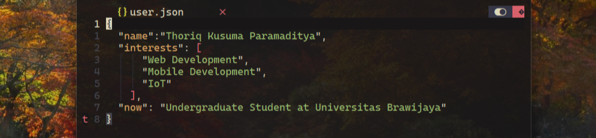

# 🌻 Thoriq Kusuma

**`Programming Enthusiast`**

Hello everyone! My name is Thoriq Kusuma, and I'm currently an undergraduate Computer Engineering student. I'm constantly learning and experimenting with new technologies. Let's connect and build something amazing together!

   

        
        
   

#

### 🧰 Tools and Skills

#
### 📊 Stats

